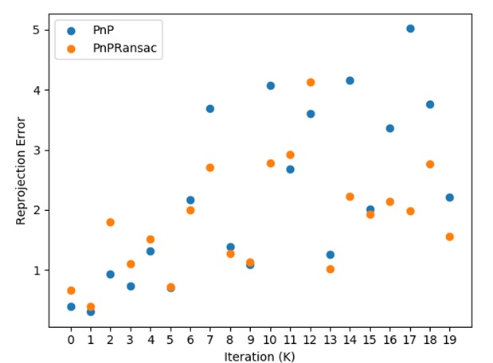

# Cross-Calibration_Noise-Robustness
Study on the noise robustness of a closed-form solution to the problem
of cross-calibration between stereoscopic vision systems and 3D remote eye and gaze
trackers. In many applications, it is essential to discover where the gaze of a person locates in
a 3D stereoscopic depth map, and while published algorithms are iterative, there is a closedform
solution which employs an efficient algorithm for solving the Perspective-n-Point (PnP)
problem.

In our case, the stereoscopic vision system provides 3D points Pi in its own coordinate
system. However, the eye tracker provides only an eye position ei and a gaze vector ⃗gi for
each Pi fixated by the observer. We do not have 2D image points corresponding to the 3D
stereoscopic points. An effective way of solving this problem is to perspective project the
vectors ⃗gi onto a virtual projective plane perpendicular to the line of sight of the eye tracker
at a distance of 1 from the projection center of the tracker.

# How To Run the C++ Code
1. Run the make file:   $make
2. Run the executable file: ./calib.out
(A Text file named “Error.txt” will be generated. This file includes the reprojection error from PnP and PnPRansac)
3. Run the Python file “Plot_error.py” to read the text file and generate the plot. 
(The python file uses Matplotlib for visualization)

Author: Mohammad Karami
Affiliation: CS department at Western University, Canada

